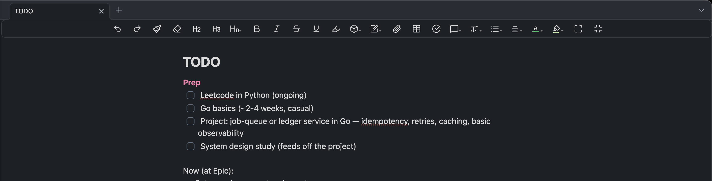
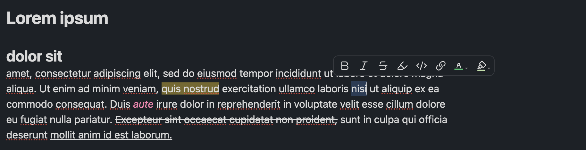
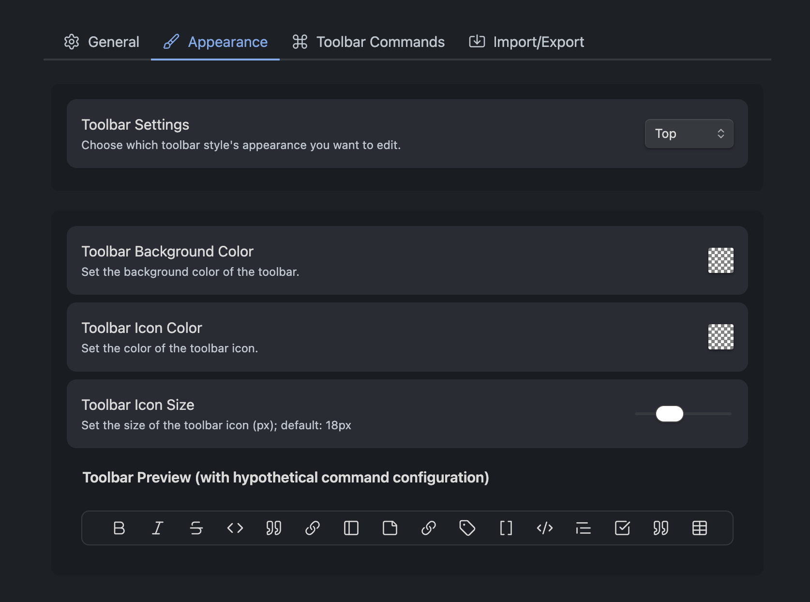
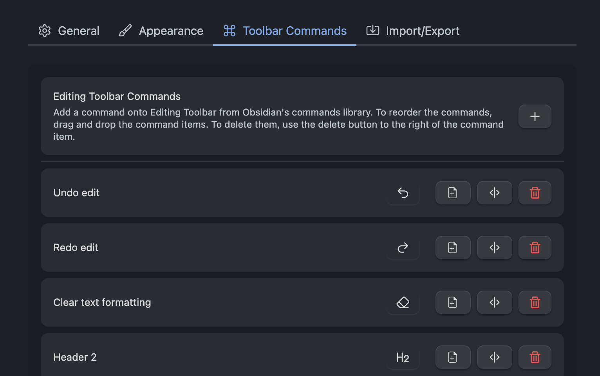

# Editing Toolbar (Unofficial)

This fork is not affiliated with or endorsed by the original author, and is **not** distributed through the Obsidian community plugin store. For the real thing, please use the [original plugin](https://github.com/cumany/obsidian-editing-toolbar).

## Contents

- [What this does](#what-this-does)
- [Install](#install)

## What this does

This is a Word-style editing toolbar for Obsidian.

**Top toolbar**



**Selection toolbar**



Config in **Settings → (unofficial) Editing Toolbar**:

**Appearance**



**Toolbar Commands**



## Install

This fork isn't on the community store, so you build and deploy it into your vault yourself.

1. Clone the repo and install dependencies:

   ```bash
   git clone https://github.com/yukisaitoo/obsidian-editing-toolbar.git
   cd obsidian-editing-toolbar
   npm install
   ```

2. Point it at your vault. Copy the example env file and set `VAULT_PATH` to your vault folder:

   ```bash
   cp .env.example .env
   # then edit .env:  VAULT_PATH="/absolute/path/to/your/obsidian/vault"
   ```

3. Build and deploy:

   ```bash
   npm run deploy
   ```

   The script builds the plugin, copies it into your vault. In Obsidian, toggle the plugin off/on under **Settings → Community plugins**, or run **Reload app without saving** from the command palette.

> [!WARNING]
> This fork uses the same plugin id (`editing-toolbar`) as the [official plugin](https://github.com/cumany/obsidian-editing-toolbar). If you're switching from the official plugin, uninstall it first through **Settings → Community plugins**.

---

_I consider this project feature-complete (at least for how I use it), so I don't plan to do further development.
That said, if you enjoy it and run into bugs, feel free to [open an issue](https://github.com/yukisaitoo/obsidian-editing-toolbar/issues)._
